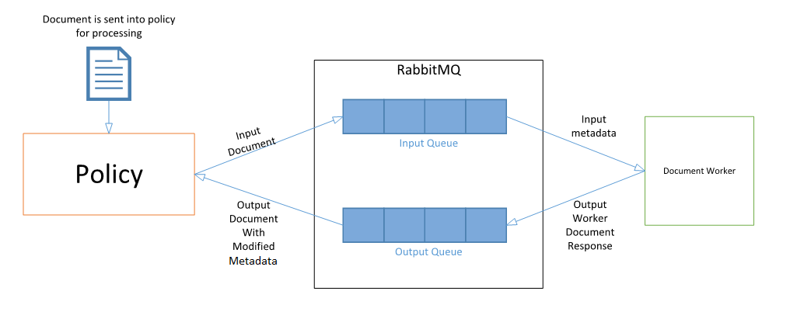

## Document Worker
A Document Worker can be used to alter the field names and values contained within the metadata of a document supplied to it. Each instance of a Document Worker will be required to be configured when implementing it to give instructions as when to change document metadata and what to change it to. An example use case for a Document Worker is given below, followed by a brief overview of the modules that make up this repository.

### Example use case for a Document Worker
A Document Worker can be completely configured for each individual instance running.  This means that multiple Document Workers could be operating and performing different functions simultaneously. In the case of this example let us assume that a case has arisen that required a lookup to check the `metadata` fields on documents for a specific value, field or encoding type. Once found the worker would then evaluate its response based on the logic set forth within its implementation. For this example we will assume that it was looking for a field called `JOB_TITLE` that contains a value of `C-Level-Exec`. Once our example worker looks through the meta data of the document and has found this field and value, it will then implement the custom logic that was set out during its implementation, which for this case will be that if `JOB_TITLE` is equal to `C-Level-Exec` add a new field to the metadata called `IGNORE_FILE` and set the value of this field to `true`. The Document Worker will then pass back a result object to the Document Worker converter. The `DocumentWorkerResult` object will then contain a map of field names to Lists of `DocumentWorkerFieldValue` objects. Each `DocumentWorkerFieldValue` object will contain a value and an encoding. The Document Worker has two actions that can be used to achieve three goals. The first goal is `add`, this action can be used to add values onto a current field as well as to add a new field to a document's metadata. The second is `replace`, and this action can be used to achieve two goals: to replace a current field or data values with information specified by the worker, or to remove metadata from a document. This is achieved by the Document Worker passing back a field name with an action of `replace` and a data value of `null`. The converter will then recognise that replacing a field with a value of `null` is a signal to delete the field and do so. The new metadata fields or values added to a document can then be used in other workers to enable decision making. With regards to this example the new field added to the document `IGNORE_FILE` can be used in other workers to make the decision to ignore documents linked to a person with a `JOB_TITLE` of `C-Level-Exec`.

Below is an illustration showing the communication between a document-worker and `Policy` using `RabbitMQ`:



## Modules

### worker-document-utility
This repository defines the public classes that facilitate the creation of mutable and read only document objects. The project can be found in [worker-document-utility](worker-document-utility).

### worker-document

This repository defines public base classes which facilitate the creation of projects generated from the [worker-document-archetype](worker-document-archetype). The project can be found in [worker-document](worker-document).

### worker-document-archetype

This repository is a Maven Archetype template for the generation of a new generic CAF Document Worker project. Generation of a worker project with the Maven Archetype will produce a generic Document Worker with minimal functionality. The project can be found in [worker-document-archetype](worker-document-archetype).

### worker-document-framework

This project is used for centralizing dependency information for a Document Worker. The project can be found in [worker-document-framework](worker-document-framework).

### worker-document-interface

This library defines public interfaces to assist with the implementation of a Document Worker. The project can be found in [worker-document-interface](worker-document-interface).

### worker-document-shared

This is the shared library defining public classes that constitute the worker interface to be used by consumers of the Document Worker. The project can be found in [worker-document-shared](worker-document-shared).

### worker-document-testing

This contains implementations of the testing framework to allow for integration testing of the Document Worker. The project can be found in [worker-document-testing](worker-document-testing).

## Document Worker Event Handlers

It is not mandatory that the workflow script file should contain all of the below event handlers.

The event handler will only be triggered, if there is corresponding function from the JavaScript file being executed.

####  onProcessTask

```
/* global thisScript */

function onProcessTask(e)
{	
    // e.application  (read-only)
    // e.task         (read-only)
    // e.rootDocument (read-only)
}	
```
This is the first function called by worker on the task message.
This function is passed `TaskEventObject` as an argument . 

The structure of the `TaskEventObject` is below. The variables will be initialized with values from task message and it will be sent to the series of other functions in the workflow for further processing.

```
{
    "type" : "object",
    
     properties : {
        "application"  : { "type" : "object"},
        "task"         : { "type" : "object"},
        "rootDocument" : { "type" : "object"}        
    }
    
}
```
For more details of the `TaskEventObject`, refer the java implementation of the class [TaskEventObject.java](worker-document/src/main/java/com/hpe/caf/worker/document/scripting/events/TaskEventObject.java)

#### onBeforeProcessDocument

```
function onBeforeProcessDocument(e)
{
    // e.application  (read-only)
    // e.task         (read-only)
    // e.rootDocument (read-only)
    // e.document     (read-only)
    // e.cancel       (writable) (default: false)
}
```
This event will be executed after `onProcessTask` and before processing of a document. 
This function is passed `CancelableDocumentEventObject` as an argument.

The structure of the `CancelableDocumentEventObject` is below.

```
{
    "type" : "object",
    
     properties : {
        "application"  : { "type" : "object"},
        "task"         : { "type" : "object"},
        "rootDocument" : { "type" : "object"},
        "document"     : { "type" : "object"},    
        "cancel"       : { "type" : "boolean"}
    }
    
}
```
Set e.cancel = true to cancel processing of the document.
This flag is used to determine if that individual document should be processed by the worker.

If the cancellation flag set to true, onProcessDocument and onAfterProcessDocument will not be triggered and onAfterProcessTask will only be triggered.

For more details of the `CancelableDocumentEventObject`, refer the Java implementation of for the class [CancelableDocumentEventObject.java](worker-document/src/main/java/com/hpe/caf/worker/document/scripting/events/CancelableDocumentEventObject.java) 

#### onProcessDocument

```
function onProcessDocument(e)
{
    // e.application  (read-only)
    // e.task         (read-only)
    // e.rootDocument (read-only)
    // e.document     (read-only)
}
```
This function is called after onBeforeProcessDocument (if cancellation was not requested).
This function is passed `DocumentEventObject` as an argument.

The structure of the `DocumentEventObject` is below.

```
{
    "type" : "object",
    
     properties : {
        "application"  : { "type" : "object"},
        "task"         : { "type" : "object"},
        "rootDocument" : { "type" : "object"},
        "document"     : { "type" : "object"}   
        
    }
    
}
```
For more details  of the `DocumentEventObject`, refer to the java implementation for the class [DocumentEventObject](worker-document/src/main/java/com/hpe/caf/worker/document/scripting/events/DocumentEventObject.java)

#### onAfterProcessDocument

```
function onAfterProcessDocument(e)
{
    // e.application  (read-only)
    // e.task         (read-only)
    // e.rootDocument (read-only)
    // e.document     (read-only)
}
```
This function will be called once the processing of the document completed successfully.
This function is passed `DocumentEventObject` as an argument. 

The structure of the `DocumentEventObject` is explained in [onProcessDocument](#onProcessDocument) section.

#### onAfterProcessTask

```
function onAfterProcessTask(e)
{
    // e.application  (read-only)
    // e.task         (read-only)
    // e.rootDocument (read-only)    
}
```
This is the last function called by worker on the task message.
This function is passed `TaskEventObject` as an argument.

The structure of the `TaskEventObject` is explained in [onProcessTask](#onProcessTask) section.

Irrespective of the value of cancellation flag, this event will be triggered always while processing document.

#### onError

```
function onError(errorEvent)
{
     // errorEvent.application  (read-only)
     // errorEvent.task         (read-only)
     // errorEvent.rootDocument (read-only)
     // errorEvent.error		(read-only)
     // errorEvent.handled      (writable)  (default: false)
}
```
This function will be called in case of a failure in the worker that is not handled by the worker code. In chained workers, this will allow continuing to process the document.
This function is passed `ErrorEventObject` as an argument.

The structure of the ErrorEventObject is below.

```
{
    "type" : "object",
    
     properties : {
        "application"  : { "type" : "object"},
        "task"         : { "type" : "object"},
        "rootDocument" : { "type" : "object"},
        "error"        : { "type" : "object"},    
        "handled"      : { "type" : "boolean"}
    }
    
}
```
For more details of the `ErrorEventObject`, refer the java implementation of the class for the class [ErrorEventObject](worker-document/src/main/java/com/hpe/caf/worker/document/scripting/events/ErrorEventObject.java)

Set errorEvent.handled = true to indicate if the error was handled.
If it is not handled by event handler, the change log section of the document will be updated with the failure details. 

The failure details with `failureId` and `failureMessage` will be updated under `addFailure` section of the rootDocument and sub documents seperately.
